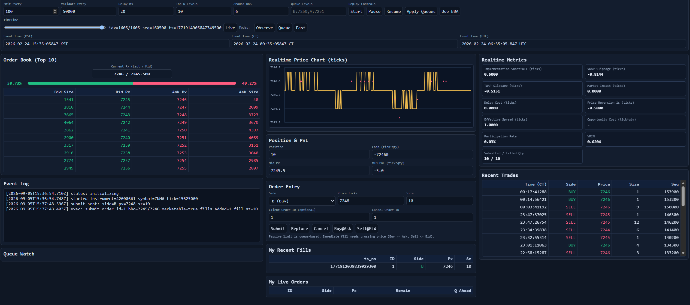
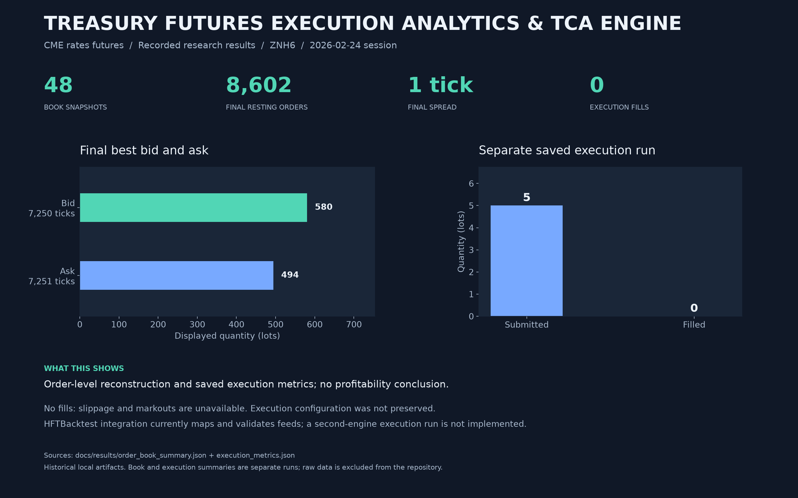

# Treasury Futures Execution Analytics & TCA Engine

Queue-aware research tools for CME rates futures using Databento MBO and
Definition records. Reconstruct order-level books, export snapshots, simulate
execution, compute execution metrics, and inspect an L3 replay dashboard.





## Setup

Python 3.12 or later is required. From the repository root:

```powershell
python -m venv .venv
.venv/Scripts/Activate.ps1
python -m pip install -e ".[data,dashboard,dev]"
python -m pytest -q
```

On macOS or Linux, activate with `source .venv/bin/activate`.
Supply your own Databento MBO and Definition files. Raw data, q binaries,
licenses, virtual environments, and generated datasets are not included.

## Replay and research

```powershell
python scripts/inspect_dbn.py data/session.mbo.dbn.zst --limit 5
python scripts/replay_order_book.py --mbo-path data/session.mbo.dbn.zst --definition-path data/session.definition.dbn.zst --output-dir outputs/book
python scripts/export_order_book_parquet.py --mbo-path data/session.mbo.dbn.zst --definition-path data/session.definition.dbn.zst --output-parquet outputs/book/snapshots.parquet
python scripts/run_l3_dashboard.py --host 127.0.0.1 --port 8000
```

Normalized session export requires filenames containing the session date:

```powershell
python scripts/export_dbn_normalized_parquet.py --mbo-path data/glbx-mdp3-20260224.mbo.dbn.zst --definition-path data/glbx-mdp3-20260224.definition.dbn.zst --output-dir outputs/normalized_parquet/20260224
python scripts/run_execution_research.py --mbo-parquet outputs/normalized_parquet/20260224/mbo_event_20260224.parquet --output-dir outputs/execution --algo pov_lite --algo-target-qty 5 --instrument-id 42004475
```

Replace dates and instrument IDs with those from your files. Each script
supports `--help`. See the [dashboard guide](docs/dashboard.md) and
[kdb+ ingestion guide](docs/kdb_ingestion.md).

## Layout

| Path | Purpose |
| --- | --- |
| `treasury_futures_execution_analytics_tca_engine/` | Types, normalization, replay, execution, metrics, adapters |
| `scripts/` | Command-line entry points and release/image generation |
| `tests/` | Book, normalization, queue, metrics, schema, and adapter tests |
| `dashboard/index.html` | Browser dashboard served by FastAPI |
| `q/` | kdb+ schema, initialization, load, and validation scripts |
| `docs/` | English guides and compact recorded result evidence |

## Recorded results and limits

The saved ZNH6 summary contains 48 snapshots and a final book with 8,602 orders,
bid 7,250 ticks / 580 lots, and ask 7,251 ticks / 494 lots. A separate saved
execution run submitted 5 lots and recorded 0 fills; slippage and markouts are
unavailable. These are historical local artifacts, not a newly rerun full-data
backtest or a profitability claim.

The book uses integer prices, sizes, and nanosecond timestamps. Execution offers
`trade_only` and `level_depletion` queue models. The HFTBacktest adapter maps
and validates feed events; `compare_execution_engines.py` does not yet execute
a second engine or establish fill parity. A calibrated latency model and a
complete quoting strategy remain future research work.

See [result provenance](docs/results/README.md) for sources and caveats.
Regenerate the image with `python scripts/render_project_results.py`.

## Prepare a GitHub upload

```powershell
python scripts/package_github.py
```

Extract `dist/Treasury Futures Execution Analytics & TCA Engine.zip` and upload its contents to a repository.
The packager explicitly selects source and public documentation, excluding
local data, caches, personal notes, and machine configuration.
See [repository organization](docs/repository_organization.md) for renamed files.

